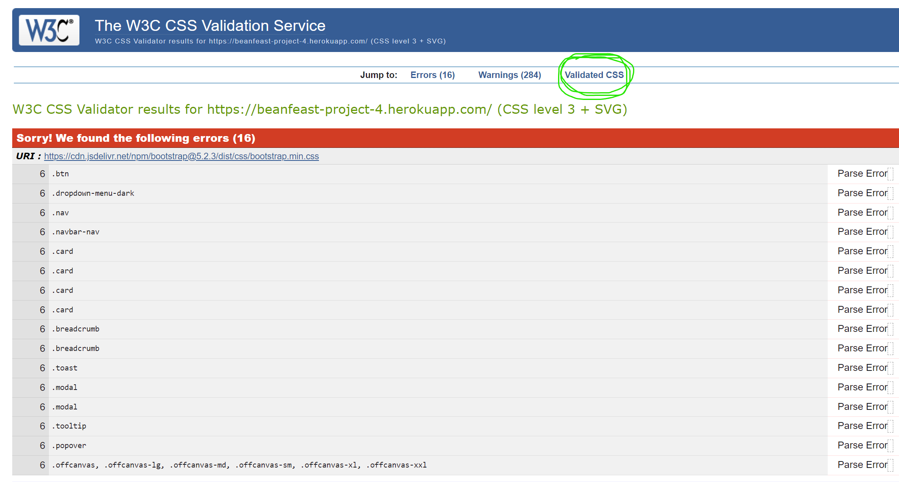
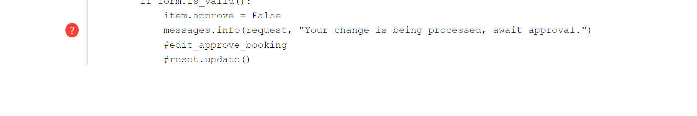
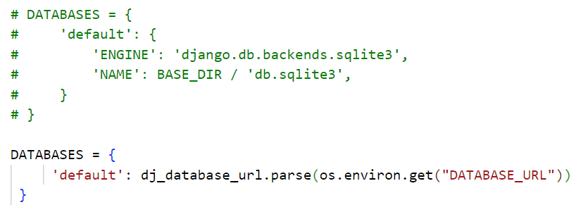
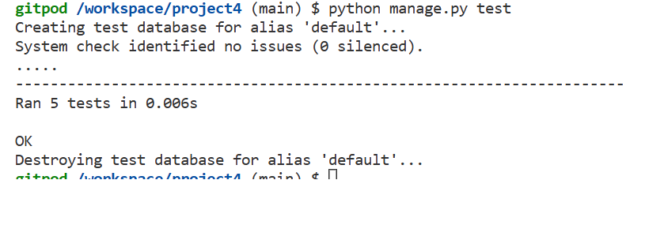
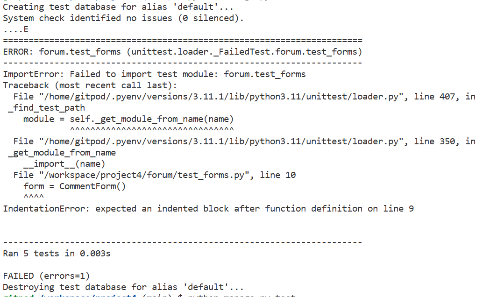
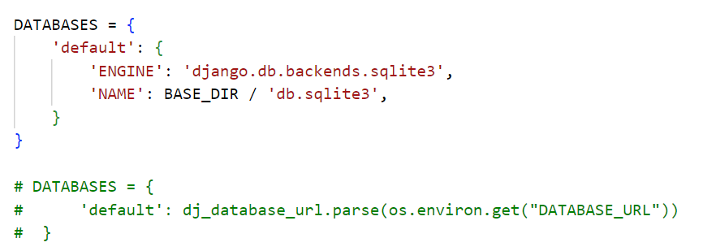
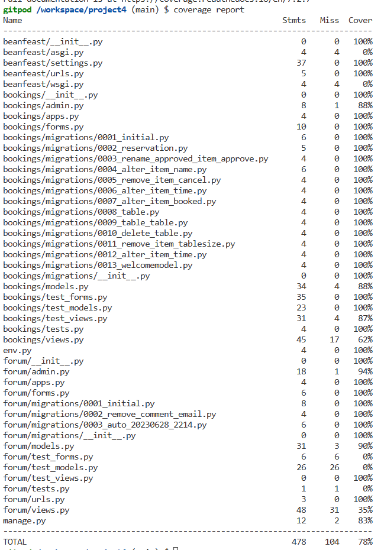
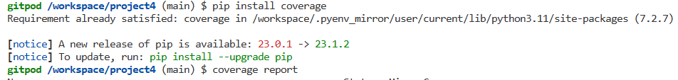

# Testing.

## HTML

[W3C Validator](https://validator.w3.org/) was used to test [HTML](https://www.w3schools.com/html) code to enure if passed certain criteria.

## CSS

[W3C Jigsaw Validator](https://jigsaw.w3.org/css-validator/) used to check the [CSS](https://www.w3schools.com/Css) code to enure it passes certain criteria for a well functioning website. 
[Bootstrap CSS](https://getbootstrap.com/) was also used to create elements of [CSS](https://www.w3schools.com/Css).
All my CSS created within static/css/style.css can be navigated to and viewed under validated CSS 
 
Validated CSS shows all my CSS within the static/css/style.css file. 
 
 

## Python

[Python Checker](https://www.pythonchecker.com/) help check code syntax and to keep to [PEP8](https://pep8.org) standards. 
 
Line of code too long for [PEP8](https://pep8.org) standards. 
 

This error below said that the '/' needed whitespace around the code, but it made the code incorrect so has been left. 
 
Image of the template error with the spacing as suggested by Pylint [Python Checker](https://www.pythonchecker.com/). 

## PEP 8 linter

[PEP8 CI](https://pep8ci.herokuapp.com/) with Code Institute to check [Python](https://www.python.org) code. 
 
PEP8 Packages can be installed in the coding environment. This image below shows the Linter not working as it should, on the coding environment during this project. 
'Problems' tag remains with - no issues. Which definately was not the case. Other linter options are avaliable. 

 

### Bookings App pylint checks.

[Python Checker](https://www.pythonchecker.com/) for Bookings / forms.py 
 

[Python Checker](https://www.pythonchecker.com/) for Bookings / admin.py 
 

[Python Checker](https://www.pythonchecker.com/) for Bookings / models.py 
 

[Python Checker](https://www.pythonchecker.com/) for Bookings / views.py 
 

### Forum App pylint checks.

[Python Checker](https://www.pythonchecker.com/) for Forum / forms.py 
 

[Python Checker](https://www.pythonchecker.com/) for Forum / admin.py 
 

[Python Checker](https://www.pythonchecker.com/) for Forum / models.py 
 

[Python Checker](https://www.pythonchecker.com/) for Forum / views.py 
 

## Test pylint for Bookings and Forum App.

To run the [Django Test Suite](https://docs.djangoproject.com/en/4.2/topics/testing/) TestCase, the Database needs changing.
**For normal code developement, use Database:** 
 
**When tesing with Django TestCase, use Database:** 
 

## Test in Django - TestCase

[Django Test Suite](https://docs.djangoproject.com/en/4.2/topics/testing/) has a built-in testing framework that can be used for tests to validate if code is working as expected using **TestCase**. 
Tests can be ran by entering 'python filename.py test' in CLI on cloud coding development environment. For this project the CLI input was 'python manage.py test' and the coding environment was [Gitpod](https://www.gitpod.io). 
**Test CLI.** 
 
**Passing tests example below.** 
 
**Failing tests example below.** 
 

## Run tests from [Django Test Suite](https://docs.djangoproject.com/en/4.2/topics/testing/) with TestCase.

To run these tests, the Database Engine environment had to be changed from [ElephantSQL](https://www.elephantsql.com) environment to [SQlite3](https://sqlite.org). 

 

 

## Coverage.

Coverage can be installed and ran to see that percentage of tests covering a website.

Coverage commands to install and run a report.

 
[Back to the top](#testing)

[Back to README.md](README.md)

